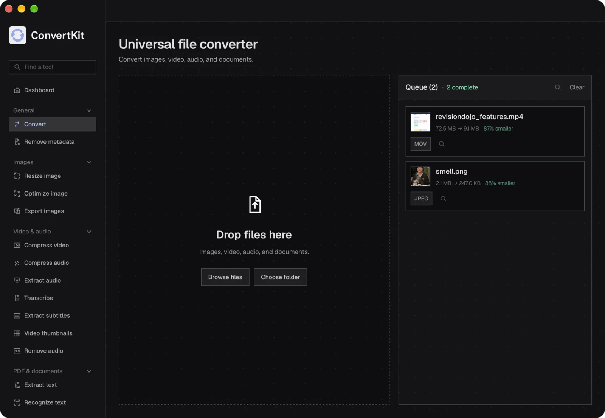
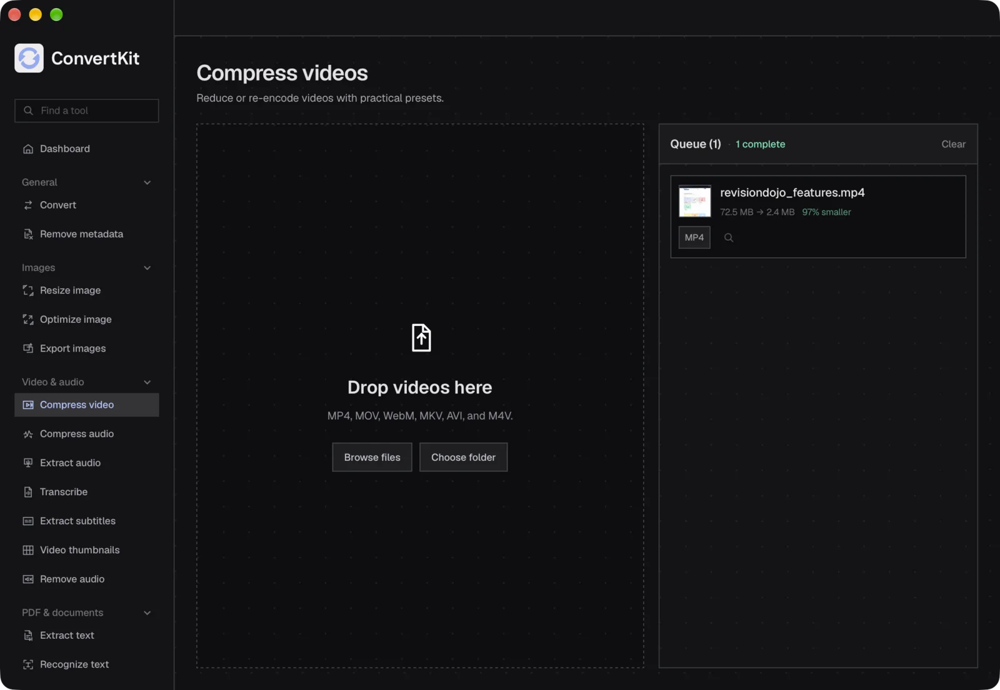
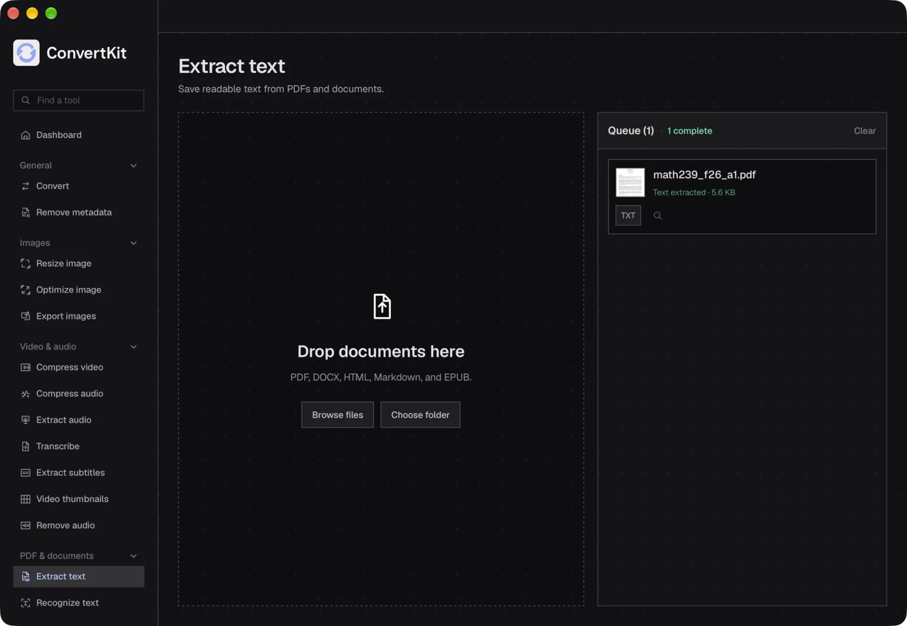
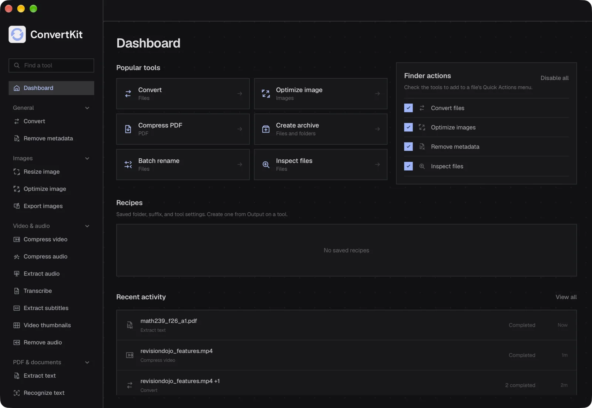

# ConvertKit

A private, offline file workspace for macOS. Convert media and documents, resize and optimize images, transcribe locally, work with PDFs and archives, and inspect files — all in one dark desktop app. Nothing is uploaded. Apple Silicon only.



## Tools

| Area | Tools |
| --- | --- |
| General | Convert, Remove metadata |
| Images | Resize, Optimize, Export variants |
| Video & audio | Compress video, Compress audio, Extract audio, Transcribe, Extract subtitles, Video thumbnails, Remove audio |
| PDF & documents | Extract text, Recognize text, Combine to PDF, Split PDF, Export PDF pages, Compress PDF |
| Organize | Create archive, Extract archive, Batch rename, Inspect files |

Sources are never overwritten. Pin tools in the sidebar, save recipes, and optionally install Finder Quick Actions from the dashboard.

## Screenshots

| Compressed video, 97% smaller | Extract text from a PDF | Dashboard and recent activity |
| :-: | :-: | :-: |
|  |  |  |

## How it works

- React builds a typed job and checks which engines are installed over Tauri IPC before anything runs.
- Rust hands each job to FFmpeg, ImageMagick, Pandoc or whisper.cpp and streams progress back as events.
- Container-only conversions skip re-encoding: ffprobe checks the codecs, then the file is remuxed instantly.

## Convert

The Convert picker is generated from `src/lib/formatMatrix.json`. Backend tests require a real engine route for every GUI option.

| Kind | Inputs | Outputs | Engine |
| --- | --- | --- | --- |
| Raster | JPEG, PNG, WebP, TIFF, BMP, GIF, ICO, AVIF, HEIC | Other rasters, SVG, or one-page PDF (PNG/JPEG) | ImageMagick, VTracer, bundled Quartz helper |
| SVG | SVG | Raster formats | resvg, ImageMagick |
| Video | MP4, MOV, WebM, MKV, AVI | Other video, GIF, or audio | FFmpeg |
| Audio | MP3, WAV, AAC, FLAC, OGG, M4A | Other audio | FFmpeg |
| Documents | DOCX, HTML, Markdown, EPUB, TXT | Other documents, including PDF | Pandoc, LibreOffice, Tectonic |
| PDF | PDF | Use the PDF tools, not Convert | Poppler, Ghostscript |

Missing engines are reported before a job starts. PDF-to-DOCX is not offered.

## Stack

Rust, Tauri 2, Tokio, React, TypeScript, Vite, Zustand, Tailwind v4, FFmpeg, whisper.cpp.

## Running locally

Requires macOS on Apple Silicon, Rust, Node 22 and pnpm, plus the engines:

```sh
brew install ffmpeg imagemagick whisper-cpp pandoc resvg tectonic poppler ghostscript
brew install oxipng jpegoptim gifsicle
brew install --cask libreoffice
cargo install vtracer
```

The packaged app bundles a pinned Whisper runtime. Tiny, Base, and Small models download on demand and stay on the Mac.

```sh
pnpm install
pnpm tauri dev
```

| Command | What it does |
| --- | --- |
| `pnpm tauri dev` | Run the desktop app |
| `pnpm tauri build` | Production DMG |
| `pnpm test` | Frontend tests |
| `pnpm check` | Type-check |
| `pnpm lint` | Lint |
| `pnpm format` | Format |
| `pnpm native:helpers` | Build OCR/PDF helpers and stage Whisper |
| `pnpm package:smoke:apple-silicon` | Ad-hoc arm64 package gate |
| `pnpm release:doctor` | Check signing/notarize tooling |
| `pnpm release:macos` | Sign, notarize, and staple the DMG |

Loaded-state visual fixtures work in Vite only:

```sh
pnpm tauri dev --no-watch --config \
  '{"build":{"beforeDevCommand":"","devUrl":"http://127.0.0.1:1420/?fixture=encodeVideo"}}'
```

## Release

Output: `src-tauri/target/release/bundle/dmg/ConvertKit_<version>_<arch>.dmg`

Credentials come from 1Password. Export secret references, never plaintext keys:

```sh
export CONVERTKIT_SIGNING_IDENTITY_REF='op://VAULT/ITEM/signing identity'
export CONVERTKIT_APPLE_API_ISSUER_REF='op://VAULT/ITEM/issuer id'
export CONVERTKIT_APPLE_API_KEY_ID_REF='op://VAULT/ITEM/key id'
export CONVERTKIT_APPLE_API_PRIVATE_KEY_REF='op://VAULT/ITEM/private key'
```

Then `pnpm release:doctor`, `pnpm release:check`, and `pnpm release:macos`.

## Shortcuts

| Shortcut | Action |
| --- | --- |
| `Cmd+K` | Find a tool |
| `Cmd+O` | Open files |
| `Enter` | Run the active tool |
| `Esc` | Cancel processing |
| `Cmd+R` | Reveal completed outputs in Finder |
| `←/→/↑/↓` | Change a focused selector |
| `Home/End` | First or last selector option |

Enter and Escape do not run or clear work while a form control has focus.

## License

MIT
